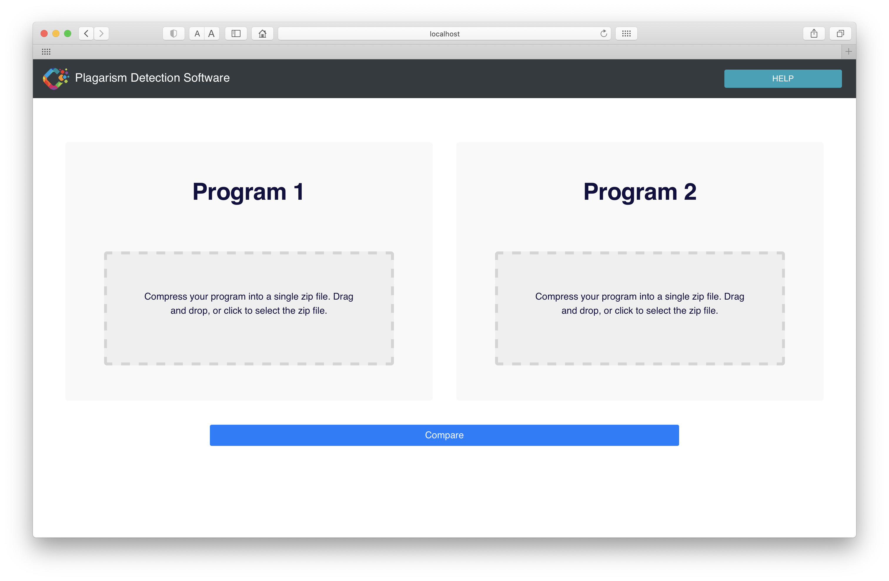
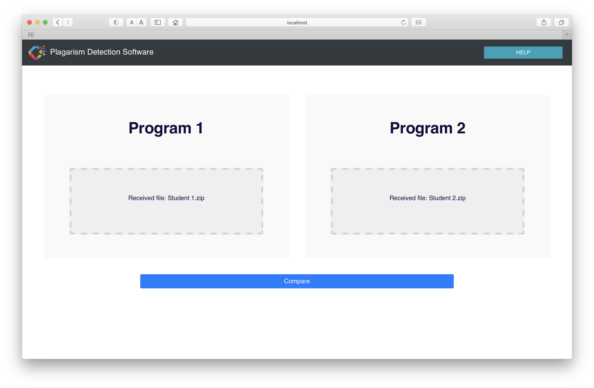
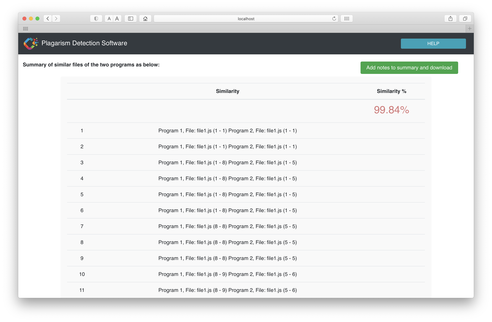
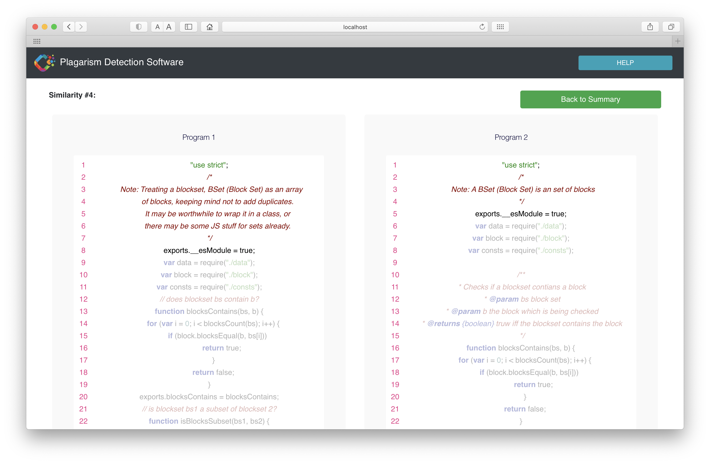
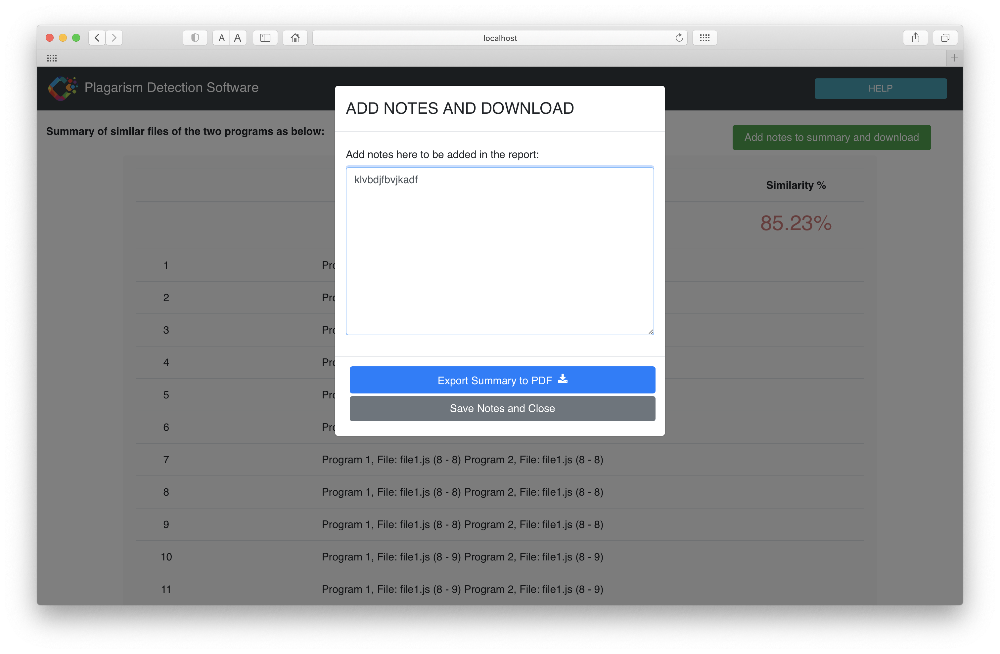

# Plagiarism Detector
## Term Project Repository for Team 11

Team Members
1. Ming-Shan Lee
2. Naveen Murali
3. Parul Jindal

[Full Report](https://docs.google.com/document/d/1JxjCj0_sXXSjdvvgVxoajOp62x8rzM4BmJfFwooNJhA/edit?usp=sharing)

## Installation Instructions 

Requirements Browser: Chrome 87, Safari 14, Firefox 83

Editor: Visual Studio Code ([link](https://code.visualstudio.com/download)), optional, not required

Download latest release of from GitHub ([link](https://github.ccs.neu.edu/CS-4530-5500-Fall-2020-Term-Project/Team-11))

### If you would like to setup through Visual Studio Code:

### Basic Setup
1. Have a compatible browser, and have VisualStudio set up on your computer.
2. Download the latest release from Github.
3. Unzip the file.
4. Open the unzipped folder in VisualStudio.
5. Click on Terminal to open a Terminal in VisualStudio.

### Install frontend

6. Type ```cd plagiarism_detector_react```
7. Type ```npm install```
8. Type ```npm start```

### Install backend

9. Click on Terminal to open another Terminal in VisualStudio.
10. Type ```cd plagiarism_detector_server```
11. Type ```npm install```
12. Type ```npm start```

### Start the webapp on browser

13. Now open your browser and go to http://localhost:3000/ or the port your system is running on.
14. Your server should be running on http://localhost:3001/ or the port your system is running on.
15. The webapp should now be running.


### If you would like to setup through the Terminal or Console directly:

### Basic Setup
1. Have a compatible browser.
2. Download the latest release from Github.
3. Unzip the file.
4. Navigate to the folder of the unzipped GitHub release.

### Install frontend

5. Type ```cd plagiarism_detector_react```
6. Type ```npm install```
7. Type ```npm start```

### Install backend

8. Open another Terminal or Console.
9. Navigate to the folder of the unzipped GitHub release.
10. Type ```cd plagiarism_detector_server```
11. Type ```npm install```
12. Type ```npm start```

### Start the webapp on browser

13. Now open your browser and go to http://localhost:3000/ or the port your system is running on.
14. Your server should be running on http://localhost:3001/ or the port your system is running on.
15. The webapp should now be running.

### Important

1. Do not close the terminal or console windows. Both the frontend and backend needs to remain running for the system to work.
2. If the server restarts, due to changing code in an editor or any other reasons, please go to the homepage and refresh the page. You will need to resubmit the files, since the server would not have the files after it has been restarted.


## User Guide

1. You can upload programs written in JavaScript.
2. The program can contain a single file or multiple files.
3. Zip the entire program into one zip file.
4. Either drag and drop or click to open the file selector to select the zip file.
5. Upload the first zip file to Program 1.
6. Upload the second zip file to Program 2.
7. To re-upload simply click on the upload box and select a new file.
8. Click on the "Compare" button to start the comparison.
9. The summary report would display a similarity percentage, and a list of similarities. 
10. You can click into each similarity to see the code highlighted indicating the detected possible plagiarized portion of the code.

## Functionality

1. Able to compare two JavaScript programs (requires the programs to be submitted as single zip file).
2. Generate a list of similarities based on our algorithm.
3. Add notes to the list of similarities.
4. Export the result as PDF.

## Screenshots

### Homepage


### Upload each program as single zip files


### After submit you get the list of similarities


### You can click on one similarity as see the lines that are flagged as similar


### You can add notes and export the list of similarities to a PDF


